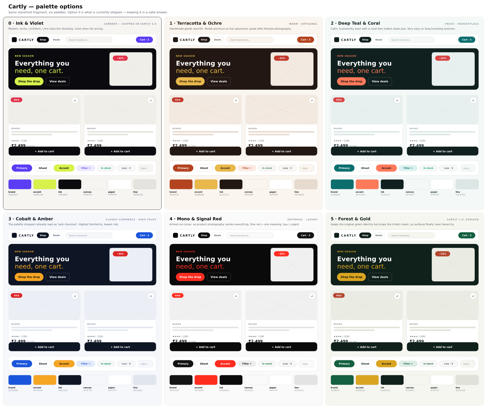

# Palette options — pick one

> Open `comparison.png` (or `comparison.svg`) for the side-by-side sheet.
> Individual panels: `00-ink-violet.svg` … `05-forest-gold.svg`.
> Regenerate after edits: `node design/palettes/generate.mjs`.

Every panel is the **same storefront fragment** — header, hero, two product
cards, controls, swatches — so the comparison is about how the UI reads, not
about hex codes in isolation.

---

## The options

| # | Palette | Brand | Accent | Feels like | Watch out for |
|---|---|---|---|---|---|
| **0** | **Ink & Violet** *(current)* | `#5B3DF5` | `#D8F14B` | Modern, techy, confident. Lime shouts, violet acts. | Violet + lime is fashionable now — it will date faster than the others. |
| **1** | **Terracotta & Ochre** | `#B4441F` | `#E8B84B` | Handmade goods, artisanal, premium at low saturation. | Warm canvas competes slightly with warm product photography. |
| **2** | **Deep Teal & Coral** | `#0D6E6E` | `#FF7A5A` | Calm marketplace; coral makes deals pop. Easy on long sessions. | Coral and the danger red sit close — needs care on sale badges. |
| **3** | **Cobalt & Amber** | `#1A56DB` | `#F5A524` | "Safe checkout." Highest familiarity, lowest risk. | The most generic — looks like every other store. |
| **4** | **Mono & Signal Red** | `#141414` | `#FF2D20` | Editorial/luxury. Photography carries the page; one red = buy/urgent. | Ruthless: bad product images have nowhere to hide. |
| **5** | **Forest & Gold** | `#14603F` | `#D9A521` | Cartly 1.x identity, evolved — green kept, tinted cream dropped. | Closest to what you already had, so it reads least "new". |

---

## How to decide

- **Want it to look current and a bit brave?** → 0 (keep) or 2.
- **Want maximum conversion safety?** → 3.
- **Want it to feel expensive?** → 4, but only if the catalog photography is good.
- **Want to keep brand continuity with 1.x?** → 5.
- **Selling homeware / craft / food?** → 1.

**Keeping option 0 is a real answer.** Nothing needs to change if you like what
shipped.

---

## Switching cost

Low, by design. Token *names* never change — only values — so a swap touches
exactly three files and no page components:

1. `design/tokens.json` — the Figma/Tokens Studio source of truth
2. `frontend/tailwind.config.js` — `colors.{brand,accent,ink,canvas,…}`
3. `frontend/src/globalTheme.ts` — the mirrored MUI palette

Plus two one-line cosmetics: `frontend/index.html` `<meta name="theme-color">`
and `frontend/public/manifest.json`.

The chosen palette's exact values live in `PALETTES` inside
`design/palettes/generate.mjs`, ready to copy across.
