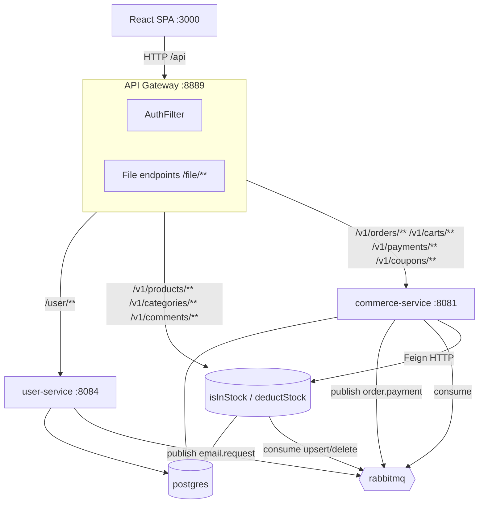
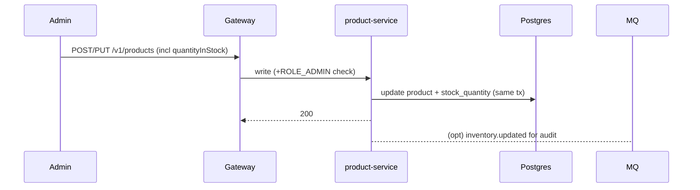

# 3. System Design

## 3.1 Component Diagram



## 3.2 Logical Runtime Boundaries

| Module | Package/role | DB schema(s) | Ownes |
|---|---|---|---|
| api-gateway | routes, auth filter, file serving | _none_ | filesystem images |
| user-service | identity | `userdb` | users, auth, email consumer |
| product-service | catalog | `productdb` | product, category, comment/rating, inventory(stock) |
| commerce-service | trade | `commercedb` | cart, order, order_item, order_address, order_status_history, payment, coupon, wishlist |
| common + event-bus | shared libs | — | audit models, Rabbit config |
| postgres | datastore | 3 DBs (one per context) | |
| rabbitmq | async broker | | |

All Java services register nothing (no Eureka). Gateway resolves upstreams by **docker DNS**: `http://user-service:8084`, `http://product-service:8080`, `http://commerce-service:8081`.

## 3.3 Data Model (single PostgreSQL instance, 3 logical DBs)

### userdb — `users`
```
users(id uuid PK, first_name, last_name, email uq, password(bcrypt),
      profile_image_url, role, authorities, is_active, is_not_locked,
      last_login_date, last_login_date_display, join_date, created_date, updated_date)
```

### productdb
```
product(id uuid PK, name, slug uq, unit_price, description, category_id FK,
        image_url, stock_quantity, deleted, created_by, created_date, updated_date)
           │ (ES doc removed; search via pg_trgm/tsvector on product + category)
category(id bigint PK, name, products…)
comment(id uuid PK, text, rating smallint 1-5, product_id FK, creator, created_date)
```

### commercedb
```
cart(id uuid PK, customer_id uuid uq, total_price, created, updated)
cart_item(id uuid PK, cart_id FK, product_id, name, price, total_price, quantity)

orders(id uuid PK, customer_id, order_status enum, address_id FK,
        total_amount, created_date, updated_date)
order_address(id uuid PK, state, district, address_detail)
order_item(id uuid PK, order_id FK, product_id, quantity, line_total)

order_status_history(id bigint PK, order_id FK, from_status, to_status, changed_at, changed_by)

payment(id bigint PK, order_id uq FK, user_id, amount, currency,
        provider enum(RAZORPAY,STRIPE,CASH), status enum(PENDING,SUCCESS,FAILED,REFUNDED),
        transaction_id, failure_reason, created_at, updated_at)

coupon(id uuid PK, code uq, discount_type enum(PERCENT,FLAT), value, expires_at,
       max_uses, used_count, min_order_amount, is_active)
coupon_usage(id uuid PK, coupon_id FK, order_id FK, user_id, discount_amount, used_at)

wishlist(id uuid PK, customer_id uq)        -- or per-product wishlist_item(product_id uq, customer_id uq)
```

> Migrations: keep `ddl-auto: update` for dev, but ship a real `init-multiple-databases.sql` that creates `userdb/productdb/commercedb` so the `postgres` image builds them on first boot.

## 3.4 API Contract (target)

All behind gateway `:8889`. Write endpoints require `ROLE_ADMIN` where marked.

| Method/Path | Service | Auth | Note |
|---|---|---|---|
| POST `/user/register`, `/user/login` | user | public | login returns access+refresh |
| GET `/user/token/refresh` | user | refresh-token header | |
| GET `/user/me`, PUT `/user/update`, PUT `/user/updatePassword` | user | user | |
| POST `/user/updateProfileImage`, GET `/user/image/**` | user | user/public | |
| GET `/v1/products?searchTerm=&page=&size=&sort=&filter=` | product | public | Postgres FTS |
| GET `/v1/products/{id}`, GET `/v1/products/{id}/comments`, GET `/v1/categories` | product | public | |
| POST `/v1/products` · PUT/DELETE `/v1/products/{id}` | product | ROLE_ADMIN | also updates stock |
| POST `/v1/categories`, POST `/v1/comments` | product | auth/ROLE_USER | comment may carry rating |
| GET/PUT/DELETE `/v1/carts?customerId=` | commerce | user (from header) | `DELETE ?productId=` |
| POST `/v1/orders` , GET `/v1/orders?pageNo=&pageSize=` | commerce | user | create = validate stock→deduct→save |
| GET `/v1/orders/{id}/track` | commerce | owner/admin | status timeline |
| POST `/v1/payments` | commerce | user (from header) | provider=RAZORPAY/STRIPE/CASH |
| POST `/v1/coupons/validate` , GET `/v1/coupons` | commerce | user / admin | |
| PUT `/v1/orders/{id}/approve` · `/cancel` | commerce | ROLE_ADMIN | |
| POST `/file/saveImage`, GET `/file/image/{name}`, DELETE `/file/removeImage` | gateway | public/auth (admin) | |
| POST `/v1/inventories/isInStock`, `/deductStock` | product (internal) | internal Feign | not exposed via gateway |

## 3.5 Async Event Catalog (RabbitMQ)

| Exchange | Routing key | Producer | Payload | Consumer |
|---|---|---|---|---|
| `inventory.exchange` | `create/update/delete.inventory.routing-key` | product-service →(self, dropped) | `InventoryRequest` | (removed with inventory merge) |
| `notification.exchange` | `send.email.routing-key` | user-service (pw reset), commerce-service (order confirm) | `EmailRequest{email,subject,text}` | user-service `EmailConsumer` |
| `order.exchange` | `payment.status.updated` | commerce-service (pay) | `PaymentStatusEvent{orderId,status,provider,transactionId}` | commerce-service `PaymentStatusConsumer` |

> Because order+payment now share one JVM, `payment.status.updated` is optional (direct method call is fine). The **event stays** as the portable, decoupled fallback (works if you later split payments out) and is what a portfolio demonstrates.

## 3.6 Key Sequences

### Checkout (order create + pay)
```mermaid
sequenceDiagram
  participant FE as React SPA
  participant GW as Gateway
  participant CS as commerce-service
  participant PS as product-service
  participant PG as Postgres
  participant MQ as RabbitMQ
  participant US as user-service(email)

  FE->>GW: POST /v1/orders (address, items, coupon?)
  GW->>CS: forward (+ userId header)
  CS->>PS: POST /v1/inventories/isInStock (items)
  PS-->>CS: ok/not-in-stock
  alt out of stock
    CS-->>FE: 409 ProductNotInStock
  else
    CS->>PS: POST /v1/inventories/deductStock
    CS->>PG: save order (PENDING) + address + items + status_history
    CS-->>FE: 201 orderDto
    FE->>CS: POST /v1/payments {orderId, amount, provider}
    alt provider=CASH
      CS->>PG: payment SUCCESS; order PAID
    else Razorpay/Stripe
      CS->>PM(provider API): charge (test pm_card)
      CS->>PG: payment SUCCESS/FAILED; order PAID/CANCELLED
    end
    CS->>MQ: payment.status.updated + email.request(order placed)
    CS-->>FE: paymentResponse
    FE->>CS: GET /v1/carts clear →
  end
```

### Authentication / refresh
```mermaid
sequenceDiagram
  participant FE as SPA
  participant GW as Gateway(AuthFilter)
  participant US as user-service
  FE->>GW: POST /user/login
  GW->>US: /user/login
  US-->>FE: access + refresh token
  FE->>GW: GET /v1/orders (Bearer)
  GW->>US: POST /user/validateToken?token=
  US-->>GW: UserDto(userId, authorities)
  GW->>DS(service): forward + headers userId/authorities/username
  Note over GW: 401 if header missing/2-part invalid; 403 if validation fails

  FE->>GW: GET /user/token/refresh (refresh-token header)
  GW->>US: refresh → new access/refresh
  US-->>FE: renewed tokens (retry original request once)
```

### Product → stock sync (in-process after merge)


## 3.7 Security Design

- **Gateway AuthFilter** (`AuthFilter`) validates `Authorization: Bearer` via `POST /user/validateToken`, then injects `userId`, `authorities`, `username` into downstream requests. 401 malformed; 403 invalid.
- **Service-side** filters trust those injected headers for writes; product adds `@PreAuthorize("hasRole('ADMIN')")` (ROLE_SUPER_ADMIN inherits authorities).
- **Fix:** dedupe `product-service` route ids so the write route with AuthFilter actually applies.
- **Commerce:** `customerId` for cart/order read from **header**, never from body query param.
- **Secrets:** `.env` (gitignored) → compose injects; `application.yml` gets `${...}` placeholders only. Remove Gmail app password + JWT secret literals.
- Purchases/payment ids validated as UUIDs; input `@Valid`.

## 3.8 Configuration & Secrets

| Var | Used by |
|---|---|
| `POSTGRES_DATASOURCE_URL`, `POSTGRES_USERNAME`, `POSTGRES_PASSWORD` | all DB services |
| `JWT_SECRET`, `JWT_ACCESS_EXPIRES`, `JWT_REFRESH_EXPIRES` | user-service (replaces hardcoded) |
| `EMAIL_USERNAME`, `EMAIL_PASSWORD`, `EMAIL_FROM` | user-service email |
| `STRIPE_SECRET_KEY`, `RAZORPAY_KEY_ID`, `RAZORPAY_KEY_SECRET` | commerce-service |
| `SPRING_RABBITMQ_HOST/PORT` | all event services |

Healthchecks: `actuator/health` gated per service; compose `condition: service_healthy` for order of startup (postgres → rabbitmq → services → gateway last).