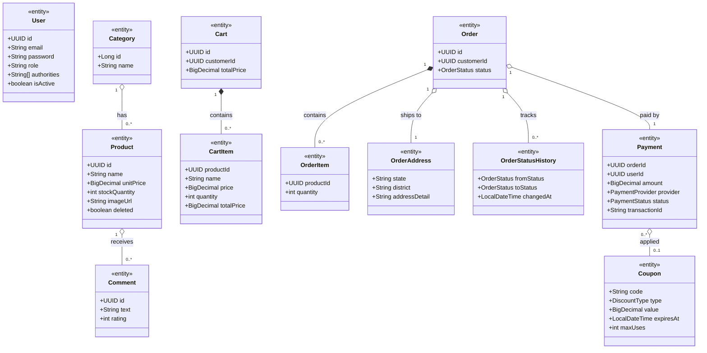
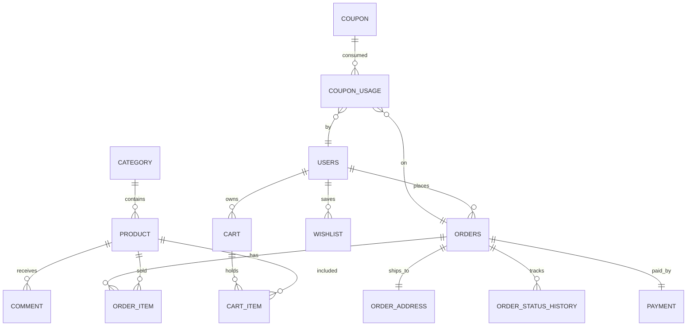
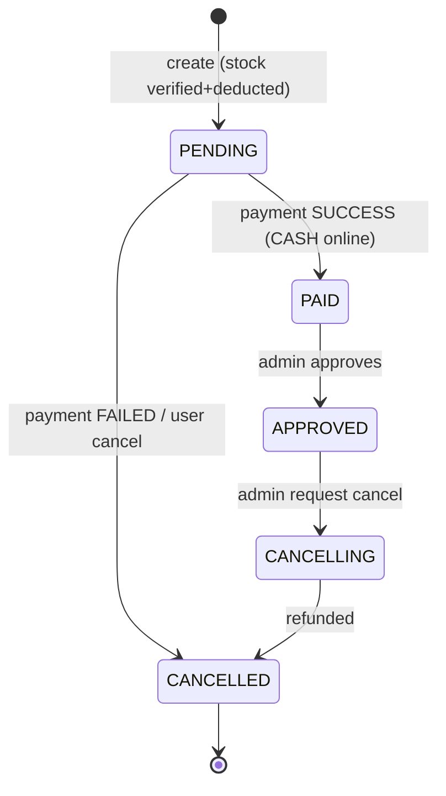
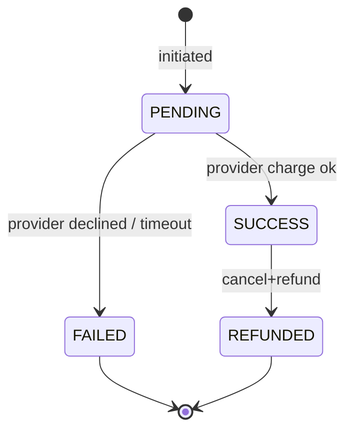
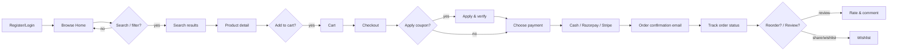
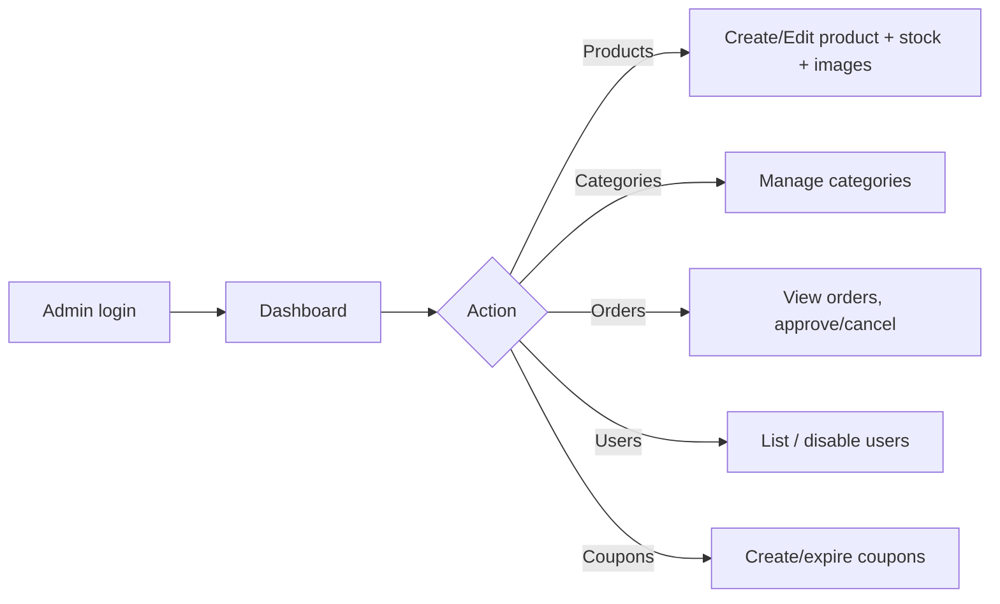

# 4. UML Diagrams & User / Design Flows

## 4.1 Use-Case Diagram

```mermaid
flowchart TB
  subgraph Actors
    C[Customer]
    A[Admin]
    S[System]
  end

  subgraph Account
    C --> UC1[Register / Login / Refresh]
    C --> UC2[Update profile & password]
    C --> UC3[Reset password via email]
    A --> UC4[Manage users]
  end

  subgraph Catalog[Catalog]
    C --> UC5[Browse & search products]
    C --> UC6[View product detail]
    C --> UC7[Review & rate product]
    C --> UC8[Add to wishlist]
    A --> UC9[CRUD products & categories]
    A --> UC10[Upload product images]
    S --> UC11[Keep stock in sync]
  end

  subgraph Commerce[Commerce]
    C --> UC12[Manage cart items]
    C --> UC13[Checkout with address]
    C --> UC14[Apply coupon]
    C --> UC15[Pay Razorpay / Stripe / Cash]
    C --> UC16[View orders & track status]
    A --> UC17[View all orders / Approve / Cancel]
    S --> UC18[Validate & deduct stock]
    S --> UC19[Notify payment status + emails]
  end
```



## 4.2 Class Diagram (core domain, per bounded context)



## 4.3 ERD (physical)



## 4.4 State Machines

### Order lifecycle (existing enum)


### Payment lifecycle (new enum includes PENDING/REFUNDED)


## 4.5 User Flows

### Customer journey


### Admin flow


## 4.6 Design Flows (screen-level)

```
/login ──▶ /register ──▶ / (home w/ Navbar CARTLY)
                            │
                            ├─ /products?search=&page=
                            │     └─ /products/:id  (review form, add-to-cart, wishlist)
                            ├─ /cart  ──▶ "Checkout with payment"
                            │               └─ /checkout (address form + order summary + pay)
                            ├─ /account (profile, password, image)
                            ├─ /profile (update info)
                            └─ /admin
                                 ├─ /admin/products (+ AddEditProduct w/ image upload)
                                 ├─ /admin/categories
                                 ├─ /admin/orders (+ OrderDetail approve/cancel)
                                 └─ (users, coupons — extend admin nav)
```

Frontend notes from current code that the redesign must respect:
- `axios` base `http://localhost:8889`, Bearer header, 401 auto-refresh (keep).
- Checkout = create order → `POST /v1/payments` → on SUCCESS clear cart & redirect home (keep; decide `PENDING` handling).
- `DashboardLayout` `bg-background` class is gone → use a defined color (`bg-slate-50`).
- Store refresh action must send `Bearer ` prefix consistently.