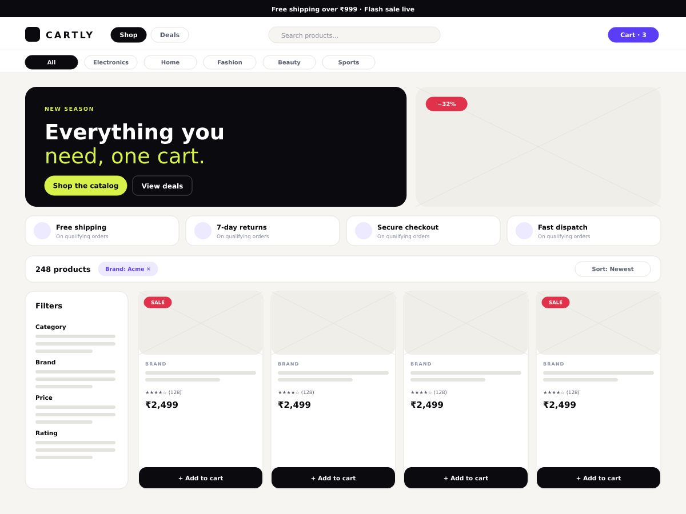

# Cartly — WordPress theme

The Cartly 2.0 design system as an installable WordPress theme, with first-class
WooCommerce support. Same tokens, same components, same shell as the React
storefront in [`frontend/`](../../frontend) — see [`design/`](../../design) for
the wireframes and tokens both are generated from.



---

## 1. Install

### Option A — upload a zip

```bash
cd wordpress
zip -r cartly.zip cartly -x 'cartly/node_modules/*' 'cartly/assets/src/*' 'cartly/bin/*'
```

Then **Appearance → Themes → Add New → Upload Theme** and activate.

### Option B — copy into the themes folder

```bash
cp -r wordpress/cartly /path/to/wp-content/themes/cartly
```

`assets/css/cartly.css` is committed, so the theme works immediately — you only
need Node if you intend to change the styles.

---

## 2. Requirements

| | |
|---|---|
| WordPress | 6.4+ |
| PHP | 8.0+ |
| WooCommerce | 8.0+ (optional — the theme degrades to a clean blog/site theme) |

---

## 3. First-run setup (5 minutes)

1. **Menus** — *Appearance → Menus*. Locations:
   - `Primary (header)` — 4 items max; the design is built for four.
   - `Category rail (storefront)` — optional. Left empty, the rail auto-fills
     with top-level WooCommerce product categories and their counts.
   - `Footer column 1/2/3` — the inverse footer's link columns.
2. **Widgets** — *Appearance → Widgets*:
   - `Shop sidebar (filters)` — drop WooCommerce *Filter by price / attribute /
     rating* widgets here. They become the facet column on product archives and
     a bottom sheet on mobile.
   - `Blog sidebar` — posts and archives.
3. **Customizer** — *Appearance → Customize*:
   - **Announcement bar** — text, a lime highlight phrase, an optional link.
     Clear the text to hide the bar entirely.
   - **Storefront hero** — eyebrow, two-line headline (second line renders in
     Instrument Serif italic lime), copy, two buttons, hero image.
   - **Footer** — blurb and the comma-separated payment badges.
4. **Front page** — *Settings → Reading*. Either works:
   - *Your latest posts* → hero, featured products, new arrivals, journal.
   - *A static page* → hero, that page's content, then the product sections.

---

## 4. What you get

### The shell (wireframe 01 / 06)
- Dismissible **announcement bar** (session-scoped, like the React app).
- **Sticky header** with the search promoted to the centre and a `⌘K` / `Ctrl+K`
  shortcut.
- **Sticky category rail** under the header on storefront views.
- **Mobile bottom tab bar** — Shop · Search · Cart · Orders · You, with a live
  cart badge; the hamburger keeps the long tail.
- **Inverse ink footer** with link columns and payment badges.
- **Dark mode**, toggled from the header or the drawer, painted before first
  paint so there is no light flash.

### Commerce (wireframes 02 / 03 / 07)
- Product card rebuilt to the design's anatomy: badge stack top-left, stock
  warning only when it matters, brand eyebrow, two-line name, rating, price row
  and a docked add-to-cart bar (Woo's AJAX button, restyled — not replaced).
- Shop archive: hero → trust strip → sticky results toolbar → facet sidebar +
  4-up grid, with a mobile filter sheet.
- Single product: buy box wrapper, ink sale badge on the gallery, and the
  delivery / returns / security trust panel.
- Styled cart, checkout, order-received and My Account screens.

### Editor
- `theme.json` exposes the palette, the four type families, the spacing scale
  and three shadow presets to the block editor, so authored content matches.
- Editor styles load the same compiled stylesheet.

---

## 5. Changing the design

Styles are Tailwind, compiled from `assets/src/`:

```bash
cd wordpress/cartly
npm install
npm run dev      # watch
npm run build    # minified -> assets/css/cartly.css
```

- `assets/src/tokens.css` — the colour tokens, `:root` (light) and `.dark`.
  **This file is a copy of `frontend/src/tokens.css`** — change both, or neither.
- `assets/src/theme.css` — the component layer plus the WordPress/WooCommerce
  integration styles.
- `tailwind.config.js` — mirrors `frontend/tailwind.config.js`.

Two token rules matter:

- **`ink*` is a foreground token.** For a surface that must stay dark in *both*
  colour schemes use `bg-contrast` + `text-oncontrast` (or `.surface-contrast`),
  never `bg-ink`.
- **Prefer `state-*` over raw palettes.** `bg-emerald-50` and friends do not
  adapt to dark mode; `bg-state-success-soft` does.

If you change `theme.json`'s palette, mirror it in `tokens.css` — WordPress uses
the former for the editor and the theme uses the latter at runtime.

---

## 6. Structure

```
cartly/
├── style.css                     theme header (+ tiny fallback)
├── theme.json                    editor palette, type, spacing, shadows
├── functions.php                 bootstrap
├── inc/
│   ├── setup.php                 supports, menus, sidebars, body class, scheme script
│   ├── enqueue.php               fonts, compiled CSS, theme JS, editor styles
│   ├── template-tags.php         branding, icons, page header, empty state, pagination
│   ├── nav-walker.php            pill / chip / drawer / stacked menu walkers
│   ├── customizer.php            announcement, hero, footer options
│   └── woocommerce.php           hooks — the bulk of the Woo design work
├── template-parts/
│   ├── header/                   announcement · navbar · category-rail · drawer
│   ├── footer/mobile-tabbar.php
│   ├── shop/sidebar.php          facets column + mobile sheet
│   ├── content/card.php          post card
│   └── hero.php                  the ink storefront hero
├── woocommerce/                  only the templates worth overriding outright
│   ├── content-product.php       the product card
│   ├── loop/no-products-found.php
│   ├── cart/cart-empty.php
│   └── global/quantity-input.php
├── assets/{src,css,js}
├── bin/lint-php.py               structural linter (see below)
└── screenshot.png
```

**Design decision worth knowing:** WooCommerce is styled mostly by *re-hooking*
(`inc/woocommerce.php`) rather than by copying its templates. Overridden
templates freeze against the Woo version they were copied from and silently rot;
hooks survive upgrades. Only four templates are overridden, each with the
`@version` it was forked at.

---

## 7. Checks

No PHP runtime is available in this repository's CI sandbox, so the theme ships
a structural linter that understands PHP islands, quoting and heredocs:

```bash
python3 wordpress/cartly/bin/lint-php.py
```

It verifies balanced delimiters, matched `if/endif`-style blocks, `ABSPATH`
guards and the absence of stray closing tags across every template. Before
shipping to a real site, also run the official tooling:

```bash
composer global require wp-coding-standards/wpcs
phpcs --standard=WordPress wordpress/cartly
```

---

## 8. Not included

This is a **theme**, not a port of the Cartly backend. It renders WooCommerce
data, not the Spring Boot services. The features the React storefront gets from
`commerce-service` — loyalty points, referrals, gift cards, price-drop alerts,
the returns workflow — would each need a WooCommerce plugin or an integration
layer against the API gateway. The theme's design language already covers those
screens (chips, status pills, feature hero), so a plugin can reuse it.
